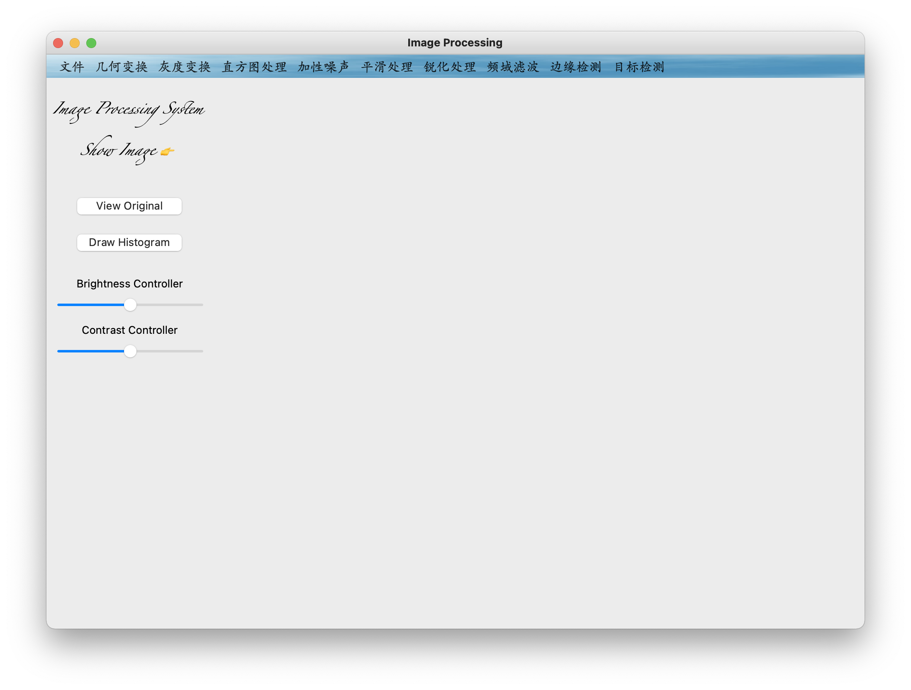

# ImageProcessing
整合常用图像处理方法和技术，设计精美UI界面，开发出一套基于OpenCV的图像处理系统
## 主界面

## 实现功能
### 文件操作
打开、关闭、保存一幅图像
### 亮度对比度调节
调整图像的亮度和对比度
### 几何变换
对图像放大、缩小、旋转、翻转
### 灰度变换
图像灰度化、图像反转、图像二值化
### 直方图处理
直方图均衡化和直方图规定化，以及直方图的绘制
### 加性噪声
高斯噪声、椒盐噪声以及随机噪声
### 平滑处理
均值滤波、中值滤波、高斯滤波以及双边滤波
### 锐化处理
选择不同的算子对图像进行锐化，包括sobel算子、robert算子、prewitt算子、laplacain算子
### 频域滤波
高通滤波和低通滤波
### 边缘检测
选择laplacian算子、sobel算子和canny算子进行边缘检测
### 目标检测
yolov5、人脸检测和图像分割

## 算法模块耦合关系

